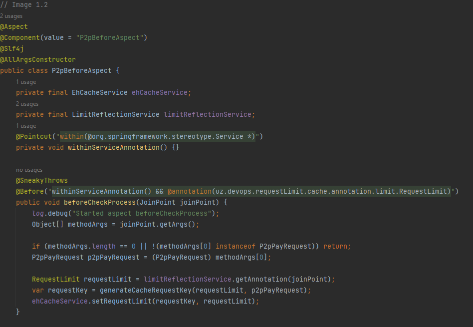

# About the project

This project is designed to set a client http request limit using spring ehCache
with the @RequestLimit annotation. To use this project you will need to add it to package 'lib' in your project.

Then write a @RequestLimit annotation above your method where you need to set the limit(Figure 1.1).

- keys - the names of the request parameters:
    - from, agentTranId, amount - the field names of the P2pPayRequest class.
    - Spring Ehcache stores data as a HashMap(Map<Object, Object>). So we will generate the key using these parameters.
      Later you will see how the hashmap key is generated using these parameters.
- timeToLive - how long to store this data in ehcache:
    - We store this time as value in the hash map, how long this data is stored in the HashMap.

Now we need to open the class aspect in our project(Figure 1.2).
You can read more about Spring AspectJ [here](https://www.baeldung.com/aspectj) and [here](https://habr.com/ru/articles/428548/).

In this aspect is written method beforeCheckProcess, which will work before our method(p2pPay), where we set the limit using @RequestLimit.
Please note that this method is only for requests with the P2pPayRequest parameter. 
If the request comes with a different parameter (that is, different from the P2pPayRequest class), 
then our requestLimit plugin will not work. This means that for each type of request you should write a separate method in the Aspect.

So now let's see what happens in this method. First we take the P2pRequest request parameter using JoinPoint(Figure 1.3).

Next, we will call the getAnnotation method on limitReflectionService to get the RequestLimit annotation(Figure 1.4).

This is necessary so that we can work with the values(keys, timeToLive) in this annotation that we previously set.

Now we will generate a unique key from the request parameters to store in ehCache(Figure 1.5).

The relationship between requestLimit and p2pPayRequest is that requestLimit provides field names indicating
which fields from p2pPayRequest should be used to create the cache key. That is, the requestLimit parameter is used to determine which fields 
from p2pPayRequest should be included to generate for the ehcache key. To get a list of field names, we call requestLimit.keys (Figure 1.6).

From the list of keys we take each of them to extract the corresponding values from p2pPayRequest. 
To do this, we will call the service [limitReflectionService.getFieldValue(fieldName, p2pPayRequest)](src/main/java/uz/devops/requestLimit/cache/service/LimitReflectionService.java) to get the p2pPayRequest field values 
based on the field names from requestLimit. These values are then added to stringKeyBuilder, separated by colons (":"), to form the cache key.

Thus, we generated a unique key for storage in ehcache. Now we can set a limit for the 'p2pPay' method(Figure 1.7).

To see how the request limit sets for the methods you can look at [ehCacheService](src/main/java/uz/devops/requestLimit/cache/service/EhCacheService.java) in this project.

If you have questions about this plugin, you can write:
[Telegram](https://t.me/ibnNemat) via Gmail: foundation240897@gmail.com

### Used technologies:
- Java 11
- Spring Boot
- Spring Ehcache